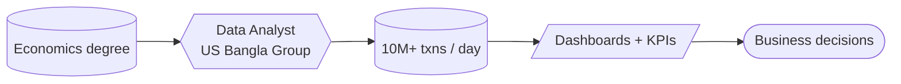
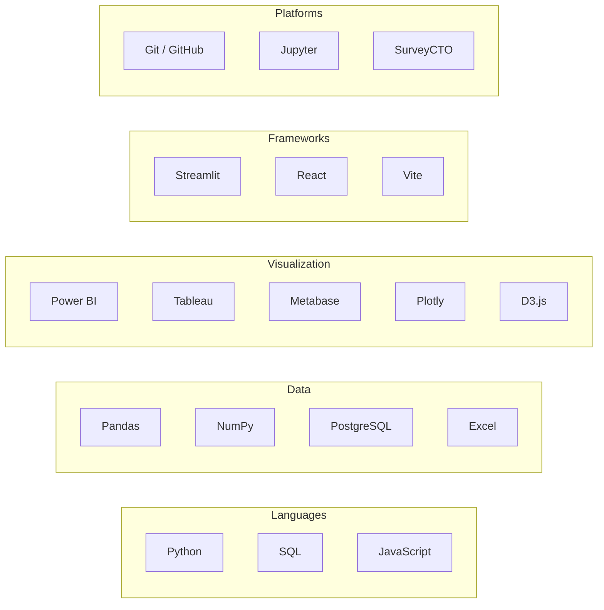
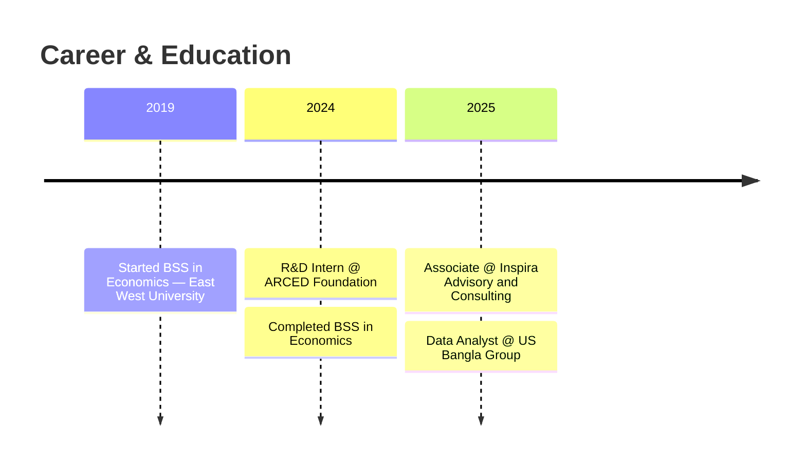
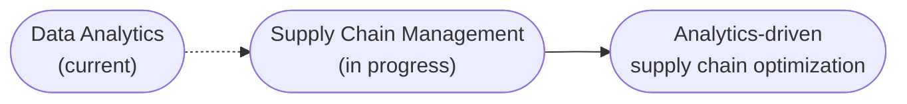

<div align="center">


<br/>

<a href="https://atikul-dipto.github.io/">portfolio</a> ·
<a href="https://www.linkedin.com/in/atikul-islam-0a77561b3/">linkedin</a> ·
<a href="mailto:atikuldipto111@gmail.com">email</a>

</div>

<br/>

## 01 · Overview

Economics graduate turned data practitioner. I take raw, messy operational data and turn it into
systems people actually use to make decisions — dashboards, pipelines, and reports that hold up
under 10M+ rows a day.



<br/>

## 02 · Stack



<br/>

## 03 · Timeline



**Data Analyst** · US Bangla Group · *Jul 2025 – Present*
Analyzing 10M+ daily e-commerce transactions, building operational KPI dashboards, cross-functional data validation.

**Associate** · Inspira Advisory and Consulting · *Jan 2025 – Jul 2025*
Market research, business evaluation, evidence-based strategic insights, client-facing reporting.

**R&D Intern** · ARCED Foundation · *Apr 2024 – Jul 2024*
Data quality audits for funded research, survey data management with SurveyCTO.

<br/>

## 04 · Projects

```
$ cd logistics-operations-portal
```
Multi-page Streamlit dashboard for e-commerce logistics analytics — shipments, inventory, and
delivery performance tracked across 5 warehouses and 5 couriers.

`Python` `Streamlit` `Pandas` `Plotly` — [repo →](https://github.com/Atikul-Dipto/logistics-portal)

```
$ cd live-logistics-flow-map
```
React + D3 visualization animating real shipment flows across a Bangladesh map, with live DBSCAN
clustering and graph centrality analysis running client-side.

`React` `D3` `Canvas` `DBSCAN` — [repo →](https://github.com/Atikul-Dipto/logistics-flow-map) · [demo →](https://atikul-dipto.github.io/logistics-flow-map/)

```
$ cd personal-portfolio
```
Interactive portfolio site with an animated particle background, live project showcase, and
glassmorphism UI.

`React` `Vite` — [repo →](https://github.com/Atikul-Dipto/Atikul-Dipto.github.io) · [live →](https://atikul-dipto.github.io/)

<br/>

## 05 · Trajectory



Currently building depth in supply chain management — procurement, logistics, demand planning —
to pair with the analytics side.

<br/>

## 06 · Connect

```js
const contact = {
  portfolio: "atikul-dipto.github.io",
  linkedin:  "in/atikul-islam-0a77561b3",
  email:     "atikuldipto111@gmail.com",
};
```

<div align="center">
<sub>data tells stories — my job is to help people understand them</sub>
</div>
