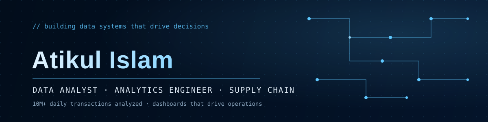

<div align="center">



<br/>

<a href="https://atikul-dipto.github.io/"></a>
&nbsp;
<a href="https://www.linkedin.com/in/atikul-islam-0a77561b3/"></a>
&nbsp;
<a href="mailto:atikuldipto111@gmail.com"></a>

</div>

<br/>

## 01 · Overview

Economics graduate turned data practitioner. I take raw, messy operational data and turn it into
systems people actually use to make decisions — dashboards, pipelines, and reports that hold up
under 10M+ rows a day.


---

## 02 · Stack

| | |
|:--|:--|
| **Languages** | Python · SQL · JavaScript |
| **Data** | Pandas · NumPy · PostgreSQL · Excel |
| **Visualization** | Power BI · Tableau · Metabase · Plotly · D3.js |
| **Frameworks** | Streamlit · React · Vite |
| **Platforms** | Git/GitHub · Jupyter · SurveyCTO |

---

## 03 · Experience

| Period | Role | Organization |
|:--|:--|:--|
| Jul 2025 – Present | Data Analyst | US Bangla Group |
| Jan 2025 – Jul 2025 | Associate | Inspira Advisory and Consulting |
| Apr 2024 – Jul 2024 | R&D Intern | ARCED Foundation |

Currently analyzing 10M+ daily e-commerce transactions and building the operational KPI dashboards
US Bangla Group runs on. Before that: market research and strategic advisory at Inspira, and data
quality audits / survey management with SurveyCTO at ARCED.

**Education** — BSS in Economics, East West University (2019 – 2024). Applied Econometrics, Game
Theory, Labor Economics, Project Analysis. Certifications in Python and pandas (DataCamp), and
Prompt Engineering (NetCom Learning).

**Next** — building depth in supply chain management (procurement, logistics, demand planning) to
pair with the analytics side.

---

## 04 · Projects

```
$ cd logistics-operations-portal
```
Multi-page Streamlit dashboard for e-commerce logistics analytics — shipments, inventory, and
delivery performance tracked across 5 warehouses and 5 couriers.

`Python` `Streamlit` `Pandas` `Plotly` — [repo →](https://github.com/Atikul-Dipto/logistics-portal)

```
$ cd live-logistics-flow-map
```
React + D3 visualization animating real shipment flows across a Bangladesh map, with live DBSCAN
clustering and graph centrality analysis running client-side.

`React` `D3` `Canvas` `DBSCAN` — [repo →](https://github.com/Atikul-Dipto/logistics-flow-map) · [demo →](https://atikul-dipto.github.io/logistics-flow-map/)

```
$ cd personal-portfolio
```
Interactive portfolio site with an animated particle background, live project showcase, and
glassmorphism UI.

`React` `Vite` — [repo →](https://github.com/Atikul-Dipto/Atikul-Dipto.github.io) · [live →](https://atikul-dipto.github.io/)

```
$ cd ats-resume-scanner
```
Scores resumes for ATS compatibility — formatting risks, missing sections, keyword gaps against
a target job description — then searches live job boards for roles matching the candidate's
extracted title, skills, and experience.

`React` `FastAPI` `scikit-learn` `NLP` — [repo →](https://github.com/Atikul-Dipto/ats-resume-scanner)

---

## 05 · Connect

```js
const contact = {
  portfolio: "atikul-dipto.github.io",
  linkedin:  "in/atikul-islam-0a77561b3",
  email:     "atikuldipto111@gmail.com",
};
```

<p align="center">
<a href="https://atikul-dipto.github.io/"></a>
&nbsp;
<a href="https://www.linkedin.com/in/atikul-islam-0a77561b3/"></a>
&nbsp;
<a href="mailto:atikuldipto111@gmail.com"></a>
</p>

<div align="center">
<sub>data tells stories — my job is to help people understand them</sub>
</div>
